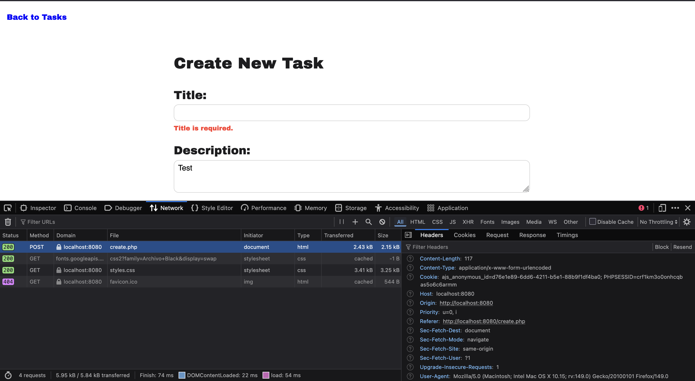
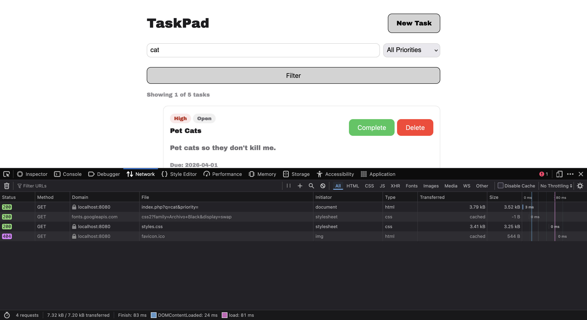
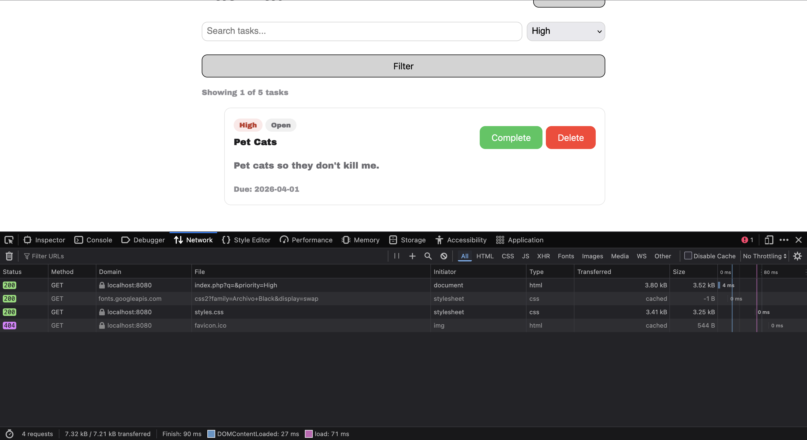
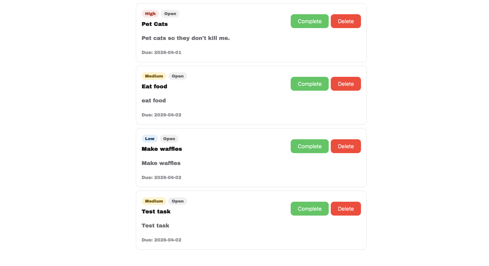
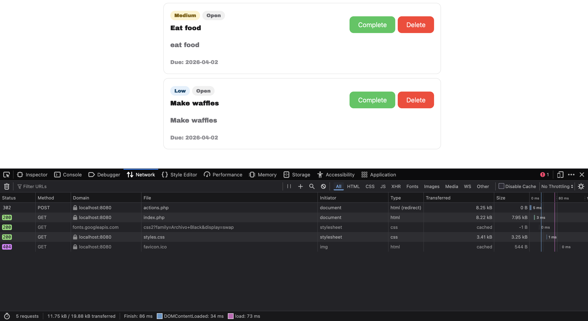

# **Test plan for task pad**

## 1. Run run_tests.php- This will output basic automated tests.

## 2. Manual tests to view status codes

### a. Create a valid task. Expected status 302 and redirect to index.php. PASSED

### b. Create a task without a title. Expected status 200 and html contains "title is required." PASSED

### c. Filter tasks. url should display index.php?q={filter}&priority={priority} test values-cat and no priority, high priority. PASSED

### d. Delete a task. Should return a 302 status code and update the page without the deleted task. Test: Delete test task PASSED

Before:

After:

